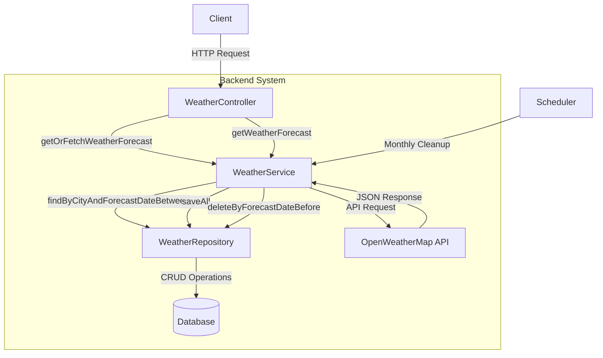
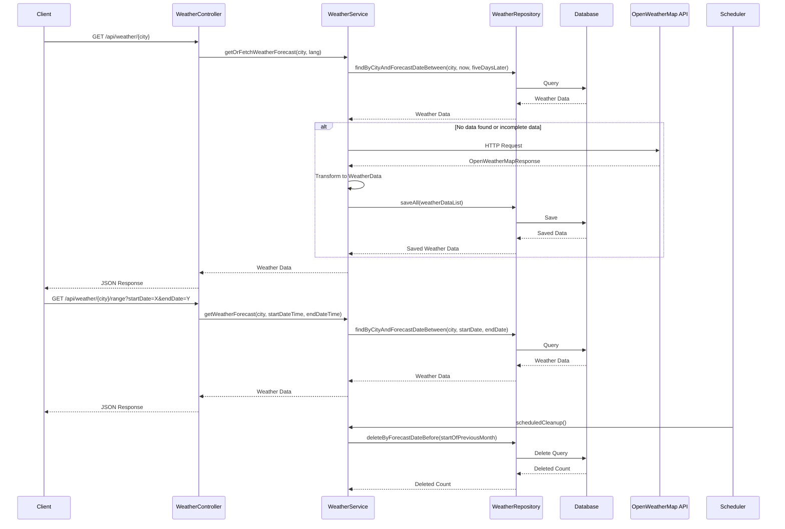

# Backend System Flowchart

This document provides a visual representation of the backend architecture for the Weather Information Network (WIN) application.

## System Architecture

## Data Flow

## Component Details

### Controller Layer
- **WeatherController**: Handles HTTP requests and routes them to the appropriate service methods.
    - `GET /api/weather/{city}`: Gets weather forecast for a city
    - `GET /api/weather/{city}/range`: Gets weather forecast for a city within a date range

### Service Layer
- **WeatherService**: Contains business logic for fetching, storing, and retrieving weather data.
    - `getOrFetchWeatherForecast`: Gets weather data from DB or fetches from API if needed
    - `fetchAndSaveWeatherForecast`: Fetches data from OpenWeatherMap API and saves to DB
    - `getWeatherForecast`: Retrieves weather data from DB
    - `deleteOldWeatherData`: Cleans up outdated weather data
    - `scheduledCleanup`: Scheduled task for monthly cleanup, keeping data from the current month and the previous month

### Repository Layer
- **WeatherRepository**: JPA repository for database operations on WeatherData entities.
    - `findByCityAndForecastDateBetween`: Finds weather data by city and date range
    - `deleteByForecastDateBefore`: Deletes old weather data

### Model Layer
- **WeatherData**: Entity model for storing weather information in the database
- **OpenWeatherMapResponse**: Data model for parsing the JSON response from OpenWeatherMap API

### External Services
- **OpenWeatherMap API**: External service providing weather forecast data